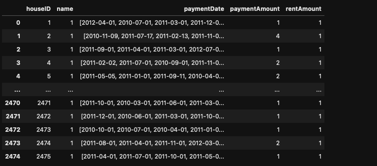
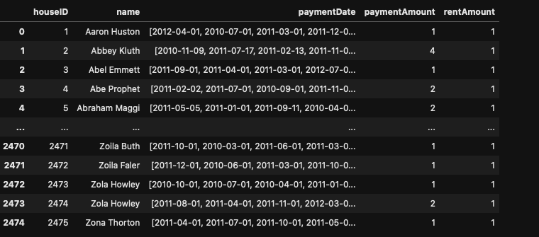
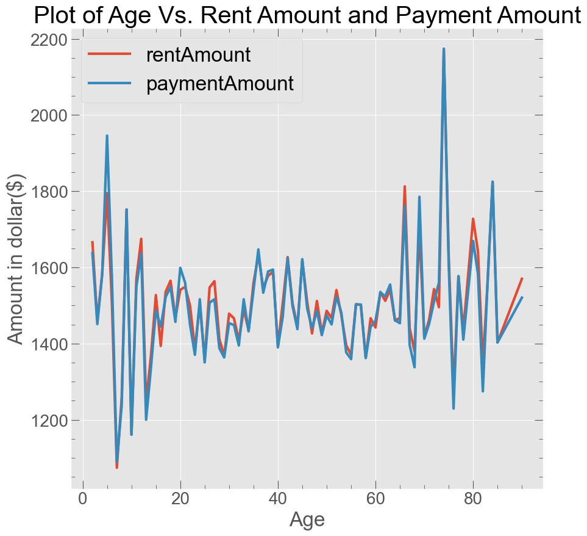
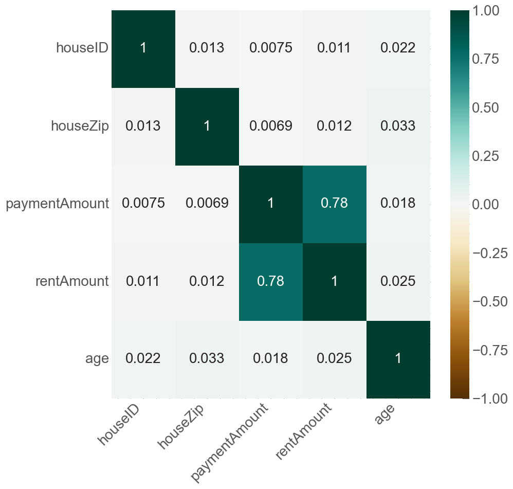
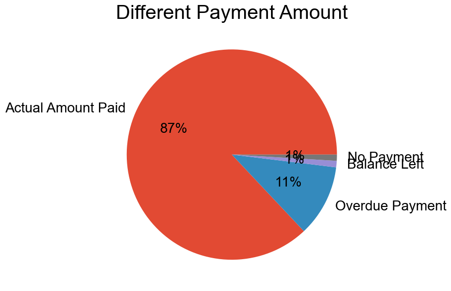
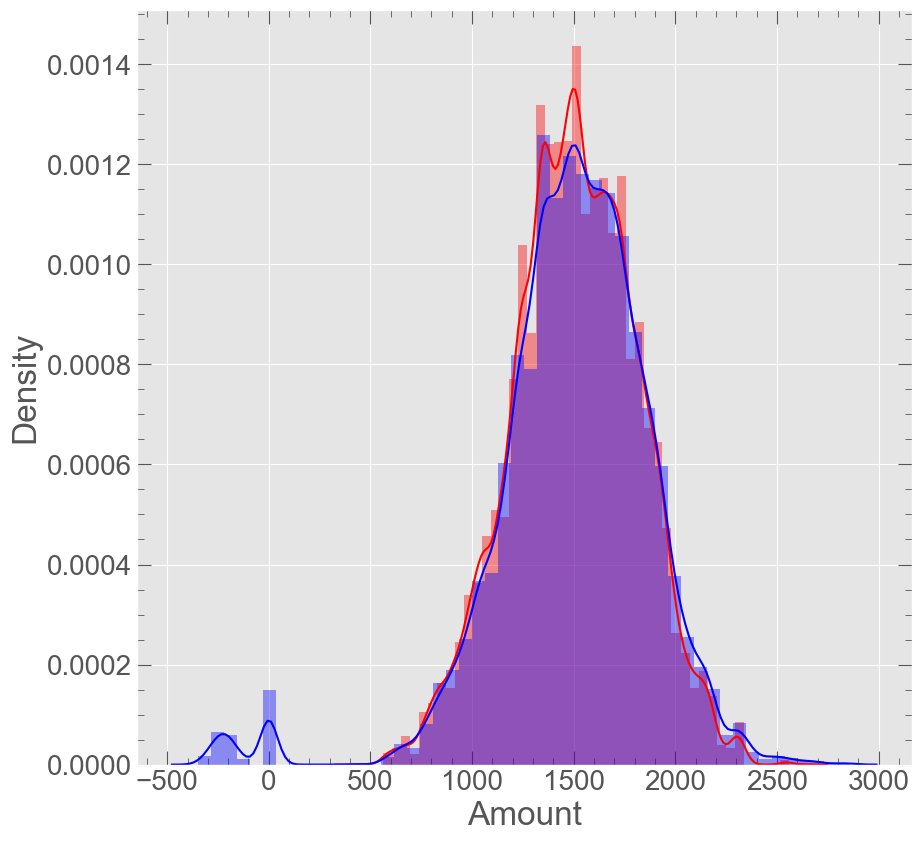
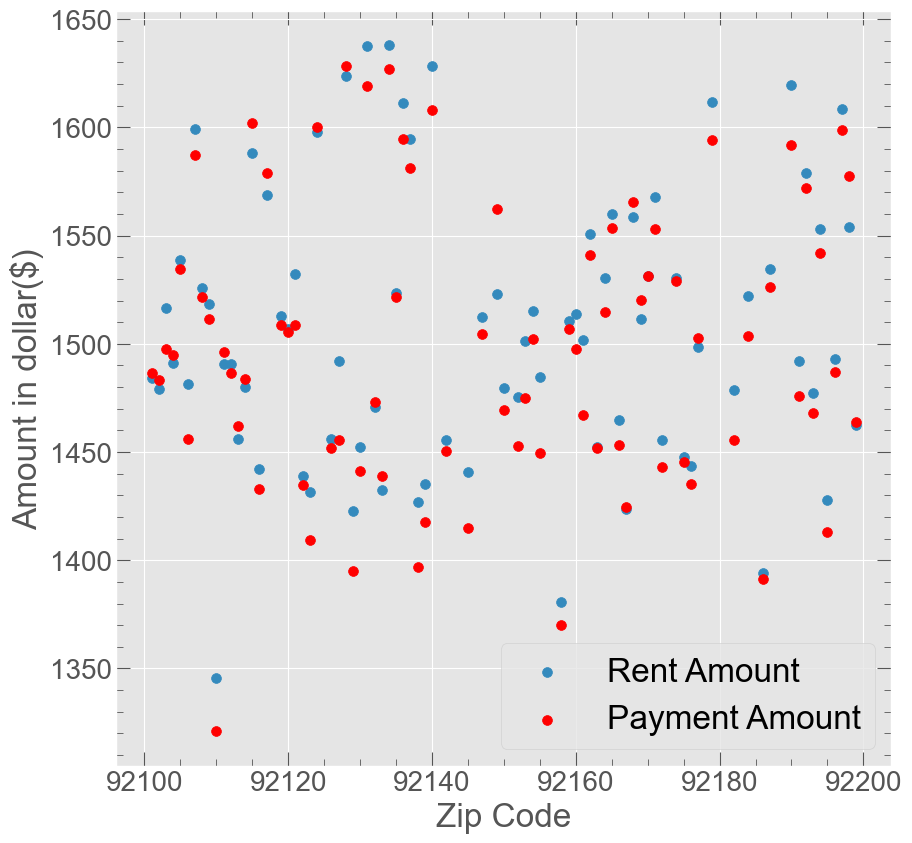
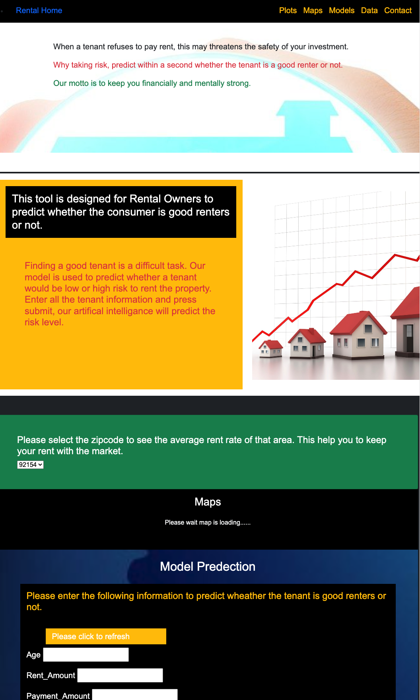

# Rental Prediction
The website is deployed to Heroku at: https://rental-pred.herokuapp.com/index.html

In this project, studied the monthly rental payment information and built a machine learning model that predict the risk level of tenant's.

## Background
Used the dataset that contains monthly rental information like rent amount, payment amount, age, payment date and other information and build the machine learning models. Created a web application for house owners to mimimize their risk factor while renting the property using the monthly rental information data. House owners also can click their zipcode to see the average monthly rent rate in that area. 

## Resources
* Monthly rental payment information for a set of renters in San Diego, CA.

## Data cleaning
Different preprocess steps were used to extract the best features. 
Following changes were made using pandas to clean the data:

* Some rows are shifted one column up, correcting this error using shift method
* Converted columns to appropriate datatypes
* Added `age` columns using date of birth columns
* Replaced Nan with 0
* Convert `paymentDate` columns to 1 or 0 based on the payment date: Before or After 10th of month.
* Added a new target column `status` based on the payment amount and rent amount (high risk, low risk)
* Used `SearchEngine` module to add differnt new features using zipcode:
`city`
`county`
`lattitude`
`longitude`
`medianIncome`
`population`
`state`
`housingUnits`
`occupiedHousingUnits`
But the data is from one city,county,and state, so this colums were removed later
* Created  and saved under-sampling data for modeling
* Created  and saved over-sampling data for modeling

### Under sampling and over sampling technique
In the original dataset, only 12% of data are categorized as high risk. To get a truly accurate model, special techniques were used on imbalanced data.
1. Under Sampling: These data have been undersampled to give an even number of high risk and low risk tenant's using undersampling techniques.   
2. over Sampling: Oversampling a technique is  used to give an even number of high risk and low risk tenant's. 

## Data visulization
Differnt plots were generated to understand the data.
Some of the questions tried to answer from the dataset are:
1. Can one person live in more than one address?
* Ans: 207 people have multiple address with Adaline Santos with 4 different address (Identified using both name and date of birth)

2. Can one address have more than one person.
* Ans: In one address, there is no more than one person information.

3. Can one address have different amount of rent? Payment?
* Ans: One address has only one rent amount but one address can have differnt payment amount with 6 address have 14 differnt payment amount.

4. Plot to check whether the hypothesis tenant’s age is related to the rent they pay seems right?
* Ans: From the graph, one can see that there is no relationship between age and rent amount and payment amount.
As the curve looks relatively constant with up and down in some age.

5. Correlation plots

6. Hypothesis testing on tenant’s age is related to the rent they pay?
* a.First defining the null and alternative hypothesis

* Alternate hypothesis - Tenant’s age is not related to the rent they pay.

* Null Hypothesis - Tenant’s age is related to the rent they pay.
* b.Setting the level of significance (alpha) to 0.05.
* c. Obtaining the p-value using Independent T-Tests
* d.p-value less or equal to 0.05: Indicates strong evidence against the null hypothesis. So rejecting the null hypothesis.

7. Payment amount always the same as the rent amount?
* Ans: The payment amount is differnt then the rent amount for some cases.

8. How many different situations are there if the payment is different?
As we can see there are four different situations if payment amount and rent amount is differnt:
a. No payment with empty payment amount section
b. More payment amount then rent amount (Over due because the payment date is always after the 10th of the month in this case)
c. Negative payment amount which can be due to balance left after rent payment
d. Actual payment amount

9.Other visulization

## Preprocessing: 
### Scaling the data
Used `StandardScaler` to scale the training and testing sets. 
### Converting categorical data to numeric
* Used `pd.get_dummies()` to convert the House Zipcode  data to numeric. 
* Used scikit-learn label encoder to for target vector

### Spliting the data into training set and testing set
*Used `traintestsplit` to split the data into training set and testing set. 80 % data is used for training set and 20 % used for testing set.

## Model Building
Created different classification models to predict patient’s risk of developing lung cancer.  Two different datasets were used to build the modls;
### Model on dataset without any additinal features

### Model on dataset with different additionl columns

Different models are built using:
* `Logistic Regression`
* `Stochastic Gradient Descent Classifier`
* `Decision Tree Classifier`
* `Random Forest Classifier`
* `Extremely Random Trees`
* `AdaBoost Classifier`
* `Gradient Boosting Classifier`

## Tuning hyperparamaters for all model
* `Grid Search CV`
* `Randomized Search CV`

## Productionization
Different languages and tools were used to build the machichine learning web app.
* `HTML`
* `CSS`
* `Javascript`
* `Bootstrap`
* `Git`
* `Flask`
* `Heroku`

* Stroed the data in MongoDB database using pymongo. 
* Created a intrecative webpage using HTML, CSS, javascript,and Bootstrap.
* Used MongoDB with Flask templating to create a new HTML page that displays all of the information.
* Created a different  routes  that query Mongo database and pass the data into an HTML template to display the data.
* The machine learning model are saved as a pickle file to used for the prediction.
* Used `Flask` servers to interact with our `Machine Learning model` and then connect the model with a web application. Deployed the flask machine learning web-app in Heroku Cloud Platform.

 The website has a differnt pages:
* `Home` User can enter the information to predict the tenant's risk factor.
To use the website applicatin tentants monthly rental information need to enter. 
Our model predict a tenant's risk levl (Low, High). 
* `Plots` Differnt plots of the studied data can be found inside this section.
* `Maps ` User can also enter the zipcode to view the average rent in that area with the google maps.
* `Model ` Different models performances metrics 
* `Data` Cleaned data used for the studied in the table format
* `Contact` Contact information

The website is deployed to Heroku at: https://rental-pred.herokuapp.com/index.html

